# Credit_Risk_Analysis

## Overview

## Resources
Data: [Loan Stats](Resources/LoanStats_2019Q1.csv)
Software: Visual Studio Code 1.71.2, Python 3.7.13, Jupyter Notebook 6.4.8
Python Libraries: numpy, pandas, sklearn, imblearn
Machine Learning Algorithms: RandomOverSampler, SMOTE, ClusterCentroids, SMOTEENN, BalancedRandomForestClassifier, EasyEnsembleClassifier

## Results

### Oversampling
#### Random Oversampling
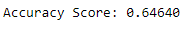
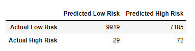

#### SMOTE Oversampling
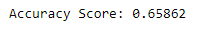
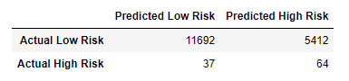
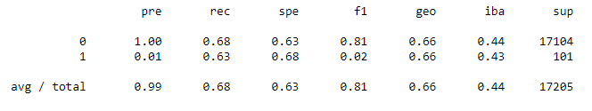

### Undersampling
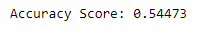
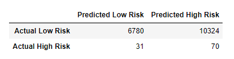
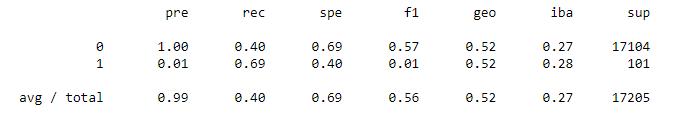

### Combination Over/Under Sampling
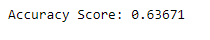
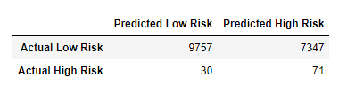
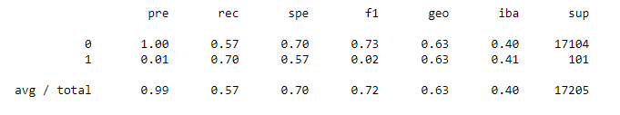

### Balanced Random Forest Classifier
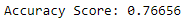
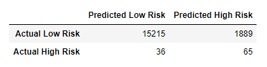
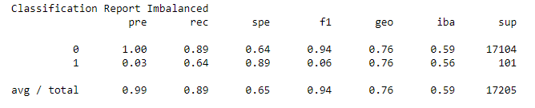
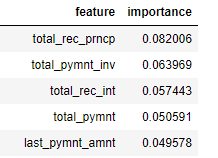

### Ensemble AdaBoost Classifier
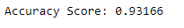
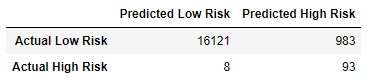
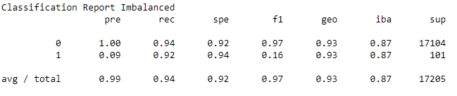

## Summary
Summarize and Recommend